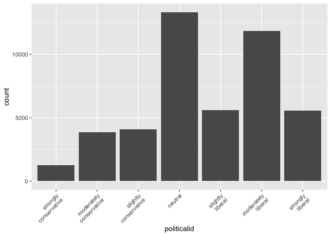
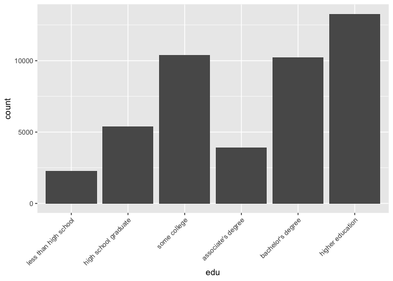

401_exploritory
================
Grace Lock
2024-03-27

``` r
library(dplyr)
```

    ## 
    ## Attaching package: 'dplyr'

    ## The following objects are masked from 'package:stats':
    ## 
    ##     filter, lag

    ## The following objects are masked from 'package:base':
    ## 
    ##     intersect, setdiff, setequal, union

``` r
library(tidyr)
library(ggplot2)
library(haven)
library(socsci)
```

    ## Loading required package: tidyverse

    ## ── Attaching core tidyverse packages ──────────────────────── tidyverse 2.0.0 ──
    ## ✔ forcats   1.0.0     ✔ readr     2.1.4
    ## ✔ lubridate 1.9.3     ✔ stringr   1.5.0
    ## ✔ purrr     1.0.2     ✔ tibble    3.2.1
    ## ── Conflicts ────────────────────────────────────────── tidyverse_conflicts() ──
    ## ✖ dplyr::filter() masks stats::filter()
    ## ✖ dplyr::lag()    masks stats::lag()
    ## ℹ Use the conflicted package (<http://conflicted.r-lib.org/>) to force all conflicts to become errors
    ## Loading required package: rlang
    ## 
    ## 
    ## Attaching package: 'rlang'
    ## 
    ## 
    ## The following objects are masked from 'package:purrr':
    ## 
    ##     %@%, flatten, flatten_chr, flatten_dbl, flatten_int, flatten_lgl,
    ##     flatten_raw, invoke, splice
    ## 
    ## 
    ## Loading required package: scales
    ## 
    ## 
    ## Attaching package: 'scales'
    ## 
    ## 
    ## The following object is masked from 'package:purrr':
    ## 
    ##     discard
    ## 
    ## 
    ## The following object is masked from 'package:readr':
    ## 
    ##     col_factor
    ## 
    ## 
    ## Loading required package: broom
    ## 
    ## Loading required package: glue

``` r
#Load all of the data

#Skintone 
skintonedata <- read_sav("/Users/gracelock/Downloads/Skin IAT.public.2023 2.sav")

skintonedata |>  dplyr::select("session_id", "birthyear", "birthSex", "politicalid_7",
                                 "num_002", "ethnicityomb", "raceomb_002", "edu", "D_biep.LightSkin_Good_all", 
                                 "att7", "Tdark", "Tlight") |>
                 na.omit("D_biep.LightSkin_Good_all") |>
                 rename("num_tests" = "num_002",
                        "ethnicity" = "ethnicityomb",
                        "race" = "raceomb_002",
                        "politicalid" = "politicalid_7",
                        "skintone_preference" = "att7",
                        "warmth_dark" = "Tdark",
                        "warmth_light" = "Tlight",
                        "score" = "D_biep.LightSkin_Good_all") |>
                 mutate(age = 2024 - birthyear) |>
                 dplyr::select(-birthyear) |>
                 mutate(
                   race = case_when(
                     race %in% c(1, 2, 3, 4, 5, 7, 8) ~ 2,
                     race == 6 ~ 1
                   )
                 )-> skintonedata

#Gender
genderdata <- read_sav("/Users/gracelock/Downloads/Gender-Career IAT.public.2023.sav")
genderdata |> dplyr::select("session_id", "birthyear", "num_002", "birthSex", "ethnicityomb", "edu",
                     "raceomb_002", "D_biep.Male_Career_all", "impcareer", "impfamily", "politicalid_7") |> 
              na.omit("D_biep.Male_Career_all") |>
              rename("num_tests" = "num_002",
                     "ethnicity" = "ethnicityomb",
                     "race" = "raceomb_002",
                     "politicalid" = "politicalid_7",
                     "score" = "D_biep.Male_Career_all",
                     "att_family" = "impfamily",
                     "att_carerr" = "impcareer") |>
              mutate(age = 2024 - birthyear) |> 
              dplyr::select(-birthyear) |>
                 mutate(
                   race = case_when(
                     race %in% c(1, 2, 3, 4, 5, 7, 8) ~ 2,
                     race == 6 ~ 1
                   )
                 ) -> genderdata

#Sexuality
sexualitydata <- read_sav("/Users/gracelock/Downloads/Sexuality IAT.public.2023.sav")
sexualitydata |> dplyr::select("session_id", "birthyear", "num_002", "birthSex", "ethnicityomb", "edu",
                     "raceomb_002", "D_biep.Straight_Good_all", "Tgayleswomen", "Tgaymen", "Tstraightmen",
                     "politicalid_7") |>
                na.omit("D_biep.Straight_Good_all") |>
                mutate(age = 2024-birthyear) |> 
                dplyr::select(-birthyear) |> 
                rename("num_tests" = "num_002",
                      "ethnicity" = "ethnicityomb",
                      "race" = "raceomb_002",
                      "politicalid" = "politicalid_7",
                      "score" = "D_biep.Straight_Good_all",
                      "warmth_gayleswomen" = "Tgayleswomen",
                      "warmth_gaymen" = "Tgaymen",
                      "warmth_straightmen" = "Tstraightmen") |>
                 mutate(
                   race = case_when(
                     race %in% c(1, 2, 3, 4, 5, 7, 8) ~ 2,
                     race == 6 ~ 1
                   )
                 ) -> sexualitydata

#Weight
weightdata <- read_sav("/Users/gracelock/Downloads/Weight IAT.public.2023.sav")
weightdata |> dplyr::select("session_id", "birthyear", "num_002", "birthSex", "ethnicityomb", "edu",
                            "politicalid_7", "raceomb_002", "D_biep.Thin_Good_all", "att7", "tthin", 
                            "tfat", "comptomost_001") |>
              na.omit("D_biep.Thin_Good_all") |>
              mutate(age = 2024-birthyear) |> 
              dplyr::select(-birthyear) |> 
              rename("num_tests" = "num_002",
                      "ethnicity" = "ethnicityomb",
                      "race" = "raceomb_002",
                      "score" = "D_biep.Thin_Good_all",
                      "body_preference" = "att7",
                      "warmth_thin" = "tthin",
                      "warmth_fat" = "tfat",
                      "comptomost" = "comptomost_001",
                      "politicalid" = "politicalid_7") |>
                 mutate(
                   race = case_when(
                     race %in% c(1, 2, 3, 4, 5, 7, 8) ~ 2,
                     race == 6 ~ 1
                   )
                 )-> weightdata
```

## Skintone data exploration

``` r
#Population data 

#Age
skintonedata |> 
  ggplot() + 
  aes(
    x = age
  ) + 
  geom_histogram()
```

    ## `stat_bin()` using `bins = 30`. Pick better value with `binwidth`.

<!-- -->

``` r
#Race
skintonedata |> 
  mutate(
    race = case_when(
      race == 1 ~ "White",
      race == 2 ~ "Not White"
    ) ) |>
  ggplot() + 
  aes(
    x = race
  ) + 
  geom_bar() 
```

<!-- -->

``` r
#Number of tests
skintonedata |> 
  ggplot() + 
  aes(
    x = num_tests
  ) + 
  geom_histogram()
```

    ## `stat_bin()` using `bins = 30`. Pick better value with `binwidth`.

<!-- -->

``` r
#Political Identification
skintonedata |> 
  mutate(
    politicalid = frcode(
      politicalid == 1 ~ "strongly\nconservative",
      politicalid == 2 ~ "moderately\nconservative",
      politicalid == 3 ~ "slightly\nconservative",
      politicalid == 4 ~ "neutral",
      politicalid == 5 ~ "slightly\nliberal",
      politicalid == 6 ~ "moderately\nliberal",
      politicalid == 7 ~ "strongly\nliberal"
    )
  ) |>
  ggplot() + 
  aes(
    x = politicalid
  ) + 
  geom_bar() +
  theme(axis.text.x = element_text(angle = 45, hjust = 1))
```

<!-- -->

``` r
#Education
skintonedata |>
  mutate(
    edu = frcode(
      edu %in% c(1, 2, 3) ~ "less than high school",
      edu == 4 ~ "high school graduate",
      edu == 5 ~ "some college",
      edu == 6 ~ "associate's degree",
      edu == 7 ~ "bachelor's degree",
      edu %in% c(8, 9, 10, 11, 12, 13, 14) ~ "higher education"
    )
  ) |>
  ggplot() + 
  aes(
    x = edu
  ) + 
  geom_bar()  +
  theme(axis.text.x = element_text(angle = 45, hjust = 1))
```

<!-- -->

``` r
#Sex
skintonedata |> 
  mutate(
    birthSex = case_when(
      birthSex == 1 ~ "Male",
      birthSex == 2 ~ "Female"
    )
  ) |>
  ggplot() +
  aes(
    x = birthSex
  ) + 
  geom_bar()
```

<!-- -->

``` r
#Skin tone Preference
skintonedata |> 
  mutate(
    skintone_preference = frcode(
      skintone_preference == 1 ~ "strongly prefer\nDark Skinned People",
      skintone_preference == 2 ~ "moderately prefer\nDark Skinned People",
      skintone_preference == 3 ~ "slightly prefer\nDark Skinned People",
      skintone_preference == 4 ~ "I like Light Skinned People and\nDark\nSkinned People equally",
      skintone_preference == 5 ~ "slightly prefer\nLight Skinned People",
      skintone_preference == 6 ~ "moderately prefer\nLight Skinned People",
      skintone_preference == 7 ~ "strongly prefer\nLight Skinned People"
    )
  ) |> 
  ggplot() + 
  aes(
    x = skintone_preference
  ) + 
  geom_bar() +
  theme(axis.text.x = element_text(angle = 45, hjust = 1))
```

<!-- -->

## Score Distributions

``` r
#Score means
mean(skintonedata$score)
```

    ## [1] 0.2744848

``` r
mean(genderdata$score)
```

    ## [1] 0.339338

``` r
mean(sexualitydata$score)
```

    ## [1] 0.1066166

``` r
mean(weightdata$score)
```

    ## [1] 0.4626187

``` r
#Score SDs
sd(skintonedata$score)
```

    ## [1] 0.4197749

``` r
sd(genderdata$score)
```

    ## [1] 0.3737222

``` r
sd(sexualitydata$score)
```

    ## [1] 0.4948397

``` r
sd(weightdata$score)
```

    ## [1] 0.4058308

``` r
skintonedata$dataset <- "Skin tone based bias"
genderdata$dataset <- "Gender based bias"
sexualitydata$dataset <- "Sexuality based bias"
weightdata$dataset <- "Weight based bias"

new_skin_df <- skintonedata[, c("session_id", "score", "dataset")]
new_gender_df <- genderdata[, c("session_id", "score", "dataset")]
new_sex_df <- sexualitydata[, c("session_id", "score", "dataset")]
new_weight_df <- weightdata[, c("session_id", "score", "dataset")]

combined_df <- rbind(new_skin_df, new_gender_df, new_sex_df, new_weight_df)

mean_values <- aggregate(score ~ dataset, data = combined_df, FUN = mean)

ggplot(combined_df, aes(x = score)) +
  geom_histogram(color = "black") +  
  facet_wrap(~ dataset, nrow = 2) +  # Facet wrap by the 'dataset' column
  ggtitle("Bias Score Distributions") +
  xlab("IAT Bias Score (d-score)") +
  ylab("Number of Participants") + 
  labs(
    caption = "Red line indicates the mean of the distribution."
  ) +
  geom_vline(data = mean_values, aes(xintercept = score), color = "red") + 
  theme_minimal()
```

    ## `stat_bin()` using `bins = 30`. Pick better value with `binwidth`.

<!-- -->

## Gender data exploration

``` r
#Population data 

#Age
genderdata |> 
  ggplot() + 
  aes(
    x = age
  ) + 
  geom_histogram()
```

    ## `stat_bin()` using `bins = 30`. Pick better value with `binwidth`.

<!-- -->

``` r
#Race
genderdata |> 
  mutate(
    race = case_when(
      race == 1 ~ "White",
      race == 2 ~ "Not White"
    ) ) |>
  ggplot() + 
  aes(
    x = race
  ) + 
  geom_bar() 
```

<!-- -->

``` r
#Number of tests
genderdata |> 
  ggplot() + 
  aes(
    x = num_tests
  ) + 
  geom_histogram()
```

    ## `stat_bin()` using `bins = 30`. Pick better value with `binwidth`.

<!-- -->

``` r
#Political Identification
genderdata |> 
  mutate(
    politicalid = frcode(
      politicalid == 1 ~ "strongly\nconservative",
      politicalid == 2 ~ "moderately\nconservative",
      politicalid == 3 ~ "slightly\nconservative",
      politicalid == 4 ~ "neutral",
      politicalid == 5 ~ "slightly\nliberal",
      politicalid == 6 ~ "moderately\nliberal",
      politicalid == 7 ~ "strongly\nliberal"
    )
  ) |>
  ggplot() + 
  aes(
    x = politicalid
  ) + 
  geom_bar() +
  theme(axis.text.x = element_text(angle = 45, hjust = 1))
```

<!-- -->

``` r
#Education
genderdata |>
  mutate(
    edu = frcode(
      edu %in% c(1, 2, 3) ~ "less than high school",
      edu == 4 ~ "high school graduate",
      edu == 5 ~ "some college",
      edu == 6 ~ "associate's degree",
      edu == 7 ~ "bachelor's degree",
      edu %in% c(8, 9, 10, 11, 12, 13, 14) ~ "higher education"
    )
  ) |>
  ggplot() + 
  aes(
    x = edu
  ) + 
  geom_bar()  +
  theme(axis.text.x = element_text(angle = 45, hjust = 1))
```

<!-- -->

``` r
#Sex
genderdata |> 
  mutate(
    birthSex = case_when(
      birthSex == 1 ~ "Male",
      birthSex == 2 ~ "Female"
    )
  ) |>
  ggplot() +
  aes(
    x = birthSex
  ) + 
  geom_bar()
```

<!-- -->

## Sexuality data exploration

``` r
#Population data 

#Age
sexualitydata |> 
  ggplot() + 
  aes(
    x = age
  ) + 
  geom_histogram()
```

    ## `stat_bin()` using `bins = 30`. Pick better value with `binwidth`.

<!-- -->

``` r
#Race
sexualitydata |> 
  mutate(
    race = case_when(
      race == 1 ~ "White",
      race == 2 ~ "Not White"
    ) ) |>
  ggplot() + 
  aes(
    x = race
  ) + 
  geom_bar() 
```

<!-- -->

``` r
#Number of tests
sexualitydata |> 
  ggplot() + 
  aes(
    x = num_tests
  ) + 
  geom_histogram()
```

    ## `stat_bin()` using `bins = 30`. Pick better value with `binwidth`.

<!-- -->

``` r
#Political Identification
sexualitydata |> 
  mutate(
    politicalid = frcode(
      politicalid == 1 ~ "strongly\nconservative",
      politicalid == 2 ~ "moderately\nconservative",
      politicalid == 3 ~ "slightly\nconservative",
      politicalid == 4 ~ "neutral",
      politicalid == 5 ~ "slightly\nliberal",
      politicalid == 6 ~ "moderately\nliberal",
      politicalid == 7 ~ "strongly\nliberal"
    )
  ) |>
  ggplot() + 
  aes(
    x = politicalid
  ) + 
  geom_bar() +
  theme(axis.text.x = element_text(angle = 45, hjust = 1))
```

<!-- -->

``` r
#Education
sexualitydata |>
  mutate(
    edu = frcode(
      edu %in% c(1, 2, 3) ~ "less than high school",
      edu == 4 ~ "high school graduate",
      edu == 5 ~ "some college",
      edu == 6 ~ "associate's degree",
      edu == 7 ~ "bachelor's degree",
      edu %in% c(8, 9, 10, 11, 12, 13, 14) ~ "higher education"
    )
  ) |>
  ggplot() + 
  aes(
    x = edu
  ) + 
  geom_bar()  +
  theme(axis.text.x = element_text(angle = 45, hjust = 1))
```

<!-- -->

``` r
#Sex
sexualitydata |> 
  mutate(
    birthSex = case_when(
      birthSex == 1 ~ "Male",
      birthSex == 2 ~ "Female"
    )
  ) |>
  ggplot() +
  aes(
    x = birthSex
  ) + 
  geom_bar()
```

<!-- -->

## Weight data exploration

``` r
#Population data 

#Age
weightdata |> 
  ggplot() + 
  aes(
    x = age
  ) + 
  geom_histogram()
```

    ## `stat_bin()` using `bins = 30`. Pick better value with `binwidth`.

<!-- -->

``` r
#Race
weightdata |> 
  mutate(
    race = case_when(
      race == 1 ~ "White",
      race == 2 ~ "Not White"
    ) ) |>
  ggplot() + 
  aes(
    x = race
  ) + 
  geom_bar() 
```

<!-- -->

``` r
#Number of tests
weightdata |> 
  ggplot() + 
  aes(
    x = num_tests
  ) + 
  geom_histogram()
```

    ## `stat_bin()` using `bins = 30`. Pick better value with `binwidth`.

<!-- -->

``` r
#Political Identification
weightdata |> 
  mutate(
    politicalid = frcode(
      politicalid == 1 ~ "strongly\nconservative",
      politicalid == 2 ~ "moderately\nconservative",
      politicalid == 3 ~ "slightly\nconservative",
      politicalid == 4 ~ "neutral",
      politicalid == 5 ~ "slightly\nliberal",
      politicalid == 6 ~ "moderately\nliberal",
      politicalid == 7 ~ "strongly\nliberal"
    )
  ) |>
  ggplot() + 
  aes(
    x = politicalid
  ) + 
  geom_bar() +
  theme(axis.text.x = element_text(angle = 45, hjust = 1))
```

<!-- -->

``` r
#Education
weightdata |>
  mutate(
    edu = frcode(
      edu %in% c(1, 2, 3) ~ "less than high school",
      edu == 4 ~ "high school graduate",
      edu == 5 ~ "some college",
      edu == 6 ~ "associate's degree",
      edu == 7 ~ "bachelor's degree",
      edu %in% c(8, 9, 10, 11, 12, 13, 14) ~ "higher education"
    )
  ) |>
  ggplot() + 
  aes(
    x = edu
  ) + 
  geom_bar()  +
  theme(axis.text.x = element_text(angle = 45, hjust = 1))
```

<!-- -->

``` r
#Sex
weightdata |> 
  mutate(
    birthSex = case_when(
      birthSex == 1 ~ "Male",
      birthSex == 2 ~ "Female"
    )
  ) |>
  ggplot() +
  aes(
    x = birthSex
  ) + 
  geom_bar()
```

<!-- -->

``` r
Skintone = c(1.02, 1.12, 0.92, 1.02, 0.85, 0.93, NA, 1.00, 1.48, NA)
Skin_sig = c(99.9, 99.9, 99.9, 99.9, 99.9, 99, NA, 0, 99.9, NA)
Gender = c(1.02, 1.01, 0.95, 1.01, 0.94, 1.67, 0.81, 1.11, 0.93, NA)
Gender_sig = c(99.9, 0, 99.9, 99.9, 99.9, 99.9, 99.9, 99.9, 99.9, NA)
Sexuality = c(1.01, 1.01, 0.77, 1.01, 0.93, 0.74, 1.21, 0.89, 0.89, 1.23)
Sex_sig = c(99, 0, 99.9, 99.9, 99.9, 99.9, 99.9, 99.9, 99.9, 99.9)
Weight = c(1.00, NA, 0.91, 1.01, 0.76, 0.86, 0.80, 1.12, 0.88, 0.87)
Weight_sig = c(0, NA, 99.9, 99.9, 99.9, 99.9, 99.9, 99.9, 99.9, 99.9)

row_labels <- c("Education", "Ethnicity", "Political Identity", "Age", "Number of Tests", 
                "Sex", "Race", "Warmth1", "Warmth2", "Warmth3")

viz_data <- data.frame(Skintone, Skin_sig, Gender, Gender_sig, Sexuality, Sex_sig, Weight, Weight_sig)
rownames(viz_data) <- row_labels

# Add row names as a separate column
viz_data$row_names <- rownames(viz_data)

# Pivot the data into longer format
pivot1_df <- dplyr::select(viz_data, row_names, Skintone, Gender, Sexuality, Weight) |>
                 pivot_longer(
                           cols = -row_names,
                           names_to = "BiasType",
                           values_to = "Value") -> pivot1_df

pivot2_df <- dplyr::select(viz_data, row_names, Skin_sig, Sex_sig, Gender_sig, Weight_sig) |>
  pivot_longer(
    cols = -row_names, 
    names_to = "BiasType",
    values_to = "Significance"
  ) |> 
  mutate(
    BiasType = case_when(
      BiasType == "Skin_sig" ~ "Skintone",
      BiasType == "Gender_sig" ~ "Gender",
      BiasType == "Sex_sig" ~ "Sexuality",
      BiasType == "Weight_sig" ~ "Weight"
    )
  ) -> pivot2_df

merged_data <- merge(x = pivot1_df, y = pivot2_df, by = c("BiasType", "row_names"))

merged_data
```

    ##     BiasType          row_names Value Significance
    ## 1     Gender                Age  1.01         99.9
    ## 2     Gender          Education  1.02         99.9
    ## 3     Gender          Ethnicity  1.01          0.0
    ## 4     Gender    Number of Tests  0.94         99.9
    ## 5     Gender Political Identity  0.95         99.9
    ## 6     Gender               Race  0.81         99.9
    ## 7     Gender                Sex  1.67         99.9
    ## 8     Gender            Warmth1  1.11         99.9
    ## 9     Gender            Warmth2  0.93         99.9
    ## 10    Gender            Warmth3    NA           NA
    ## 11 Sexuality                Age  1.01         99.9
    ## 12 Sexuality          Education  1.01         99.0
    ## 13 Sexuality          Ethnicity  1.01          0.0
    ## 14 Sexuality    Number of Tests  0.93         99.9
    ## 15 Sexuality Political Identity  0.77         99.9
    ## 16 Sexuality               Race  1.21         99.9
    ## 17 Sexuality                Sex  0.74         99.9
    ## 18 Sexuality            Warmth1  0.89         99.9
    ## 19 Sexuality            Warmth2  0.89         99.9
    ## 20 Sexuality            Warmth3  1.23         99.9
    ## 21  Skintone                Age  1.02         99.9
    ## 22  Skintone          Education  1.02         99.9
    ## 23  Skintone          Ethnicity  1.12         99.9
    ## 24  Skintone    Number of Tests  0.85         99.9
    ## 25  Skintone Political Identity  0.92         99.9
    ## 26  Skintone               Race    NA           NA
    ## 27  Skintone                Sex  0.93         99.0
    ## 28  Skintone            Warmth1  1.00          0.0
    ## 29  Skintone            Warmth2  1.48         99.9
    ## 30  Skintone            Warmth3    NA           NA
    ## 31    Weight                Age  1.01         99.9
    ## 32    Weight          Education  1.00          0.0
    ## 33    Weight          Ethnicity    NA           NA
    ## 34    Weight    Number of Tests  0.76         99.9
    ## 35    Weight Political Identity  0.91         99.9
    ## 36    Weight               Race  0.80         99.9
    ## 37    Weight                Sex  0.86         99.9
    ## 38    Weight            Warmth1  1.12         99.9
    ## 39    Weight            Warmth2  0.88         99.9
    ## 40    Weight            Warmth3  0.87         99.9

``` r
# Convert the variable to a factor with levels 0, 1, 2, and 3
merged_data$Significance <- factor(merged_data$Significance, levels = c(0, 95, 99, 99.9))

# Define colors for each level
colors <- c("gray", "blue", "green", "orange")  # You can customize the colors as needed

# Plot with ggplot
merged_data |>
  ggplot() + 
  aes(
    y = Value, 
    x = row_names,
    fill = Significance  # Use fill aesthetic for color
  ) + 
  geom_segment(aes(x=row_names, xend=row_names, y=1, yend=Value), color="grey") +
  geom_point(size=3, shape = 21) +  # Use shape 21 for filled points
  scale_fill_manual(values = colors) +  # Use manual scale for colors
  theme_light() +
  theme(
    panel.grid.major.x = element_blank(),
    panel.border = element_blank(),
    axis.ticks.x = element_blank()
  ) + 
  geom_hline(yintercept = 1, linetype = "dashed", color = "black") +
  facet_wrap(~BiasType) +
  theme(
    axis.text.x = element_text(angle = 35, hjust = 1)
  ) + 
  labs(
    title = "Logistic Regression Odds Ratio with Significance by Bias Type",
    x = "Demographics",
    y = "Odds Ratio",
    fill = "Significance Level"
  )+
  theme(legend.position = "bottom") 
```

<!-- -->
