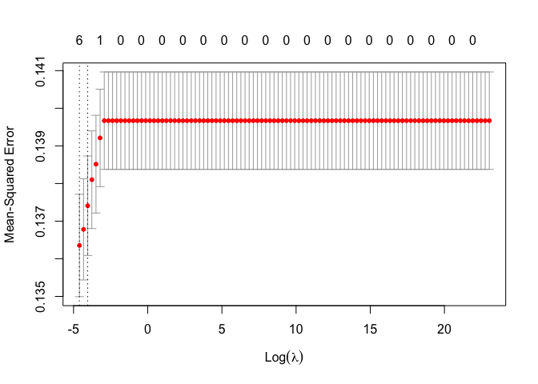

401_gender
================
Grace Lock
2024-03-27

``` r
library(haven) #Reading in the data
library(dplyr)
```

    ## 
    ## Attaching package: 'dplyr'

    ## The following objects are masked from 'package:stats':
    ## 
    ##     filter, lag

    ## The following objects are masked from 'package:base':
    ## 
    ##     intersect, setdiff, setequal, union

``` r
library(tidyverse)
```

    ## ── Attaching core tidyverse packages ──────────────────────── tidyverse 2.0.0 ──
    ## ✔ forcats   1.0.0     ✔ readr     2.1.4
    ## ✔ ggplot2   3.4.3     ✔ stringr   1.5.0
    ## ✔ lubridate 1.9.3     ✔ tibble    3.2.1
    ## ✔ purrr     1.0.2     ✔ tidyr     1.3.0

    ## ── Conflicts ────────────────────────────────────────── tidyverse_conflicts() ──
    ## ✖ dplyr::filter() masks stats::filter()
    ## ✖ dplyr::lag()    masks stats::lag()
    ## ℹ Use the conflicted package (<http://conflicted.r-lib.org/>) to force all conflicts to become errors

``` r
library(socsci) #Helps with data manipulation
```

    ## Loading required package: rlang
    ## 
    ## Attaching package: 'rlang'
    ## 
    ## The following objects are masked from 'package:purrr':
    ## 
    ##     %@%, flatten, flatten_chr, flatten_dbl, flatten_int, flatten_lgl,
    ##     flatten_raw, invoke, splice
    ## 
    ## Loading required package: scales
    ## 
    ## Attaching package: 'scales'
    ## 
    ## The following object is masked from 'package:purrr':
    ## 
    ##     discard
    ## 
    ## The following object is masked from 'package:readr':
    ## 
    ##     col_factor
    ## 
    ## Loading required package: broom
    ## Loading required package: glue

``` r
library(glmnet) #Lasso Regression
```

    ## Loading required package: Matrix
    ## 
    ## Attaching package: 'Matrix'
    ## 
    ## The following objects are masked from 'package:tidyr':
    ## 
    ##     expand, pack, unpack
    ## 
    ## Loaded glmnet 4.1-8

``` r
library(leaps) #Best subset regression
library(MASS) #Ordinal logistic regression
```

    ## 
    ## Attaching package: 'MASS'
    ## 
    ## The following object is masked from 'package:dplyr':
    ## 
    ##     select

### Gender data

``` r
genderdata <- read_sav("/Users/gracelock/Downloads/Gender-Career IAT.public.2023.sav")
```

``` r
genderdata |> dplyr::select("session_id", "birthyear", "num_002", "birthSex", "ethnicityomb", "edu",
                     "raceomb_002", "D_biep.Male_Career_all", "impcareer", "impfamily", "politicalid_7") |> 
              na.omit("D_biep.Male_Career_all") |>
              rename("num_tests" = "num_002",
                     "ethnicity" = "ethnicityomb",
                     "race" = "raceomb_002",
                     "politicalid" = "politicalid_7",
                     "score" = "D_biep.Male_Career_all",
                     "att_family" = "impfamily",
                     "att_carerr" = "impcareer") |>
              mutate(age = 2024 - birthyear) |> 
              dplyr::select(-birthyear) |>
                 mutate(
                   race = case_when(
                     race %in% c(1, 2, 3, 4, 5, 7, 8) ~ 2,
                     race == 6 ~ 1
                   )
                 ) -> genderdata
```

``` r
#LASSO Regression 

predictor_vars <- c("num_tests", "ethnicity", "race", "politicalid", "att_family", "att_carerr",
                     "age", "edu", "birthSex")

X <- as.matrix(genderdata[, predictor_vars])  # Predictor matrix
Y <- genderdata$score  # Response variable

# Create a grid of lambda values for cross-validation
lambda_grid <- 10^seq(10, -2, length = 100)

# Perform cross-validated Lasso regression
lasso_model_cv <- cv.glmnet(X, Y, alpha = 1, lambda = lambda_grid, nfolds = 10)

# Plot mean squared error (MSE) vs lambda
plot(lasso_model_cv)
```

<!-- -->

``` r
# Select lambda with minimum MSE
best_lambda <- lasso_model_cv$lambda.min

# Refit the model with the selected lambda
lasso_model_best <- glmnet(X, Y, alpha = 1, lambda = best_lambda)

# Make predictions
predictions <- predict(lasso_model_best, newx = X)

# Calculate MSE
mse <- mean((predictions - Y)^2)

# Print MSE
print(paste('Mean Squared Error (MSE):', mse))
```

    ## [1] "Mean Squared Error (MSE): 0.136293230778962"

``` r
# Print the coefficients
print(coef(lasso_model_best))
```

    ## 10 x 1 sparse Matrix of class "dgCMatrix"
    ##                        s0
    ## (Intercept)  0.1789416855
    ## num_tests   -0.0059869514
    ## ethnicity    .           
    ## race        -0.0257247305
    ## politicalid -0.0029472890
    ## att_family   0.0095657278
    ## att_carerr   .           
    ## age          0.0009982894
    ## edu          .           
    ## birthSex     0.0834180538

``` r
print(best_lambda)
```

    ## [1] 0.01

``` r
#Best Subset Selection

# Generate all possible models
  all_models <- regsubsets(score ~ num_tests + ethnicity + politicalid
                           + age + edu + birthSex + race + att_family + att_carerr, 
                           data = genderdata, nvmax = 9)
  
  # Get the summary of all models
  summary_all <- summary(all_models)
  
  # Check if summary is empty
  if (length(summary_all$adjr2) == 0) {
    cat("No models were generated.")
    return(NULL)
  }
  
  # Find the best model based on adjusted R^2
  best_model <- which.max(summary_all$adjr2)
  
  # Get the details of the best model
  best_summary <- summary_all[best_model]
  
  # Get the formula of the best model
  formula_best <- names(which(summary_all$which[best_model, ]))
  
  # Print the results
  cat("Best model formula:", paste("y ~", paste(formula_best, collapse = " + ")), "\n")
```

    ## Best model formula: y ~ (Intercept) + num_tests + politicalid + age + edu + birthSex + race + att_family + att_carerr

``` r
#Create categories

#create categories in score variable (no bias, moderate bias, strong bias)

# Define the breaks for creating three categories
breaks <- c(-Inf, -0.0001, 0.0001, 0.33, 0.66, Inf)

# Create a new categorical variable based on the breaks
genderdata$scorecat <- cut(genderdata$score, breaks = breaks, labels = c("Opposite", "None", "Low", "Medium", "High"))

# Print the summary of the new categorical variable
summary(genderdata$scorecat)
```

    ## Opposite     None      Low   Medium     High 
    ##     8011        9    13347    15143     9018

``` r
#Multi ordinal logistic regression 1 (best subset selection)

# Fit ordinal logistic regression model
gen_ord_model1 <- polr(scorecat ~ num_tests + ethnicity + politicalid
                           + age + edu + birthSex + race + att_family + att_carerr, 
                  data = genderdata, Hess = TRUE)

# Summarize the model
summary(gen_ord_model1)
```

    ## Call:
    ## polr(formula = scorecat ~ num_tests + ethnicity + politicalid + 
    ##     age + edu + birthSex + race + att_family + att_carerr, data = genderdata, 
    ##     Hess = TRUE)
    ## 
    ## Coefficients:
    ##                 Value Std. Error  t value
    ## num_tests   -0.063737  0.0077952  -8.1765
    ## ethnicity    0.008774  0.0178662   0.4911
    ## politicalid -0.047373  0.0055310  -8.5650
    ## age          0.005979  0.0007774   7.6915
    ## edu          0.015979  0.0039992   3.9955
    ## birthSex     0.512847  0.0196139  26.1471
    ## race        -0.206700  0.0185997 -11.1131
    ## att_family   0.106969  0.0109688   9.7521
    ## att_carerr  -0.073744  0.0111280  -6.6269
    ## 
    ## Intercepts:
    ##               Value    Std. Error t value 
    ## Opposite|None  -0.8001   0.0865    -9.2541
    ## None|Low       -0.7987   0.0865    -9.2381
    ## Low|Medium      0.6476   0.0864     7.4995
    ## Medium|High     2.1950   0.0869    25.2562
    ## 
    ## Residual Deviance: 122094.85 
    ## AIC: 122120.85

``` r
#Multi ordinal logistic regression 2 (lasso)

# Fit ordinal logistic regression model
gen_ord_model2 <- polr(scorecat ~ num_tests + politicalid
                           + age + birthSex + att_family + att_carerr, 
                  data = genderdata, Hess = TRUE)

# Summarize the model
summary(gen_ord_model2)
```

    ## Call:
    ## polr(formula = scorecat ~ num_tests + politicalid + age + birthSex + 
    ##     att_family + att_carerr, data = genderdata, Hess = TRUE)
    ## 
    ## Coefficients:
    ##                 Value Std. Error t value
    ## num_tests   -0.060281  0.0077897  -7.739
    ## politicalid -0.045825  0.0054897  -8.347
    ## age          0.008056  0.0006852  11.758
    ## birthSex     0.519550  0.0195953  26.514
    ## att_family   0.110872  0.0109643  10.112
    ## att_carerr  -0.084555  0.0110658  -7.641
    ## 
    ## Intercepts:
    ##               Value   Std. Error t value
    ## Opposite|None -0.5873  0.0733    -8.0140
    ## None|Low      -0.5851  0.0733    -7.9836
    ## Low|Medium     0.8608  0.0733    11.7456
    ## Medium|High    2.4059  0.0740    32.5020
    ## 
    ## Residual Deviance: 122238.14 
    ## AIC: 122258.14

Ord model 1 has the lowest AIC.

``` r
#table 
ctable <- coef(summary(gen_ord_model1))

#calculate and store p values
p <- pnorm(abs(ctable[, "t value"]), lower.tail = FALSE) * 2

## combined table
ctable <- cbind(ctable, "p value" = p)

# Define significance levels
significance <- ifelse(ctable[, "p value"] < 0.001, "***",
                       ifelse(ctable[, "p value"] < 0.01, "**",
                              ifelse(ctable[, "p value"] < 0.05, "*",
                                     ifelse(ctable[, "p value"] < 0.1, ".",""))))

# Add significance levels to the table
ctable <- cbind(ctable, "Significance" = significance)

ctable
```

    ##               Value                 Std. Error             t value            
    ## num_tests     "-0.0637374847618114" "0.00779516861040724"  "-8.17653702534621"
    ## ethnicity     "0.00877388800566476" "0.0178661612311481"   "0.491089713797515"
    ## politicalid   "-0.0473731718648173" "0.00553100025595523"  "-8.56502796466345"
    ## age           "0.00597915725764778" "0.000777372808427057" "7.69149266970896" 
    ## edu           "0.0159786427068678"  "0.00399916406654271"  "3.99549566884396" 
    ## birthSex      "0.512846651605665"   "0.0196139377457352"   "26.1470520735785" 
    ## race          "-0.206700208012621"  "0.0185996732192245"   "-11.1131096539361"
    ## att_family    "0.106969135548647"   "0.0109687904904661"   "9.75213590246101" 
    ## att_carerr    "-0.0737442621885122" "0.0111279571074033"   "-6.62693623607256"
    ## Opposite|None "-0.800066859295181"  "0.0864557916433615"   "-9.25405741000596"
    ## None|Low      "-0.798681431342123"  "0.0864552234154371"   "-9.23809342906068"
    ## Low|Medium    "0.647619964569596"   "0.0863553138851243"   "7.49948017595193" 
    ## Medium|High   "2.1950005573593"     "0.0869093009509737"   "25.2562215245238" 
    ##               p value                 Significance
    ## num_tests     "2.92117789870155e-16"  "***"       
    ## ethnicity     "0.623362996377409"     ""          
    ## politicalid   "1.08049618609454e-17"  "***"       
    ## age           "1.45428266792824e-14"  "***"       
    ## edu           "6.45590374946911e-05"  "***"       
    ## birthSex      "1.06461442085261e-150" "***"       
    ## race          "1.08320401057213e-28"  "***"       
    ## att_family    "1.80627244012086e-22"  "***"       
    ## att_carerr    "3.42725586312977e-11"  "***"       
    ## Opposite|None "2.16128889923851e-20"  "***"       
    ## None|Low      "2.50928357118667e-20"  "***"       
    ## Low|Medium    "6.40714111054703e-14"  "***"       
    ## Medium|High   "9.67659211838202e-141" "***"

``` r
#Confidence intervals 

ci <- confint(gen_ord_model1)
```

    ## Waiting for profiling to be done...

``` r
ci
```

    ##                    2.5 %       97.5 %
    ## num_tests   -0.079019388 -0.048460956
    ## ethnicity   -0.026245867  0.043789441
    ## politicalid -0.058208553 -0.036526998
    ## age          0.004454669  0.007498967
    ## edu          0.008148768  0.023825090
    ## birthSex     0.474417985  0.551301568
    ## race        -0.243141277 -0.170234955
    ## att_family   0.085466616  0.128464616
    ## att_carerr  -0.095562339 -0.051940561

``` r
#Odds Ratio and confidence intervals 

exp(cbind(OR = coef(gen_ord_model1), ci))
```

    ##                    OR     2.5 %    97.5 %
    ## num_tests   0.9382513 0.9240220 0.9526945
    ## ethnicity   1.0088125 0.9740956 1.0447623
    ## politicalid 0.9537314 0.9434532 0.9641321
    ## age         1.0059971 1.0044646 1.0075272
    ## edu         1.0161070 1.0081821 1.0241112
    ## birthSex    1.6700385 1.6070786 1.7355104
    ## race        0.8132634 0.7841607 0.8434666
    ## att_family  1.1128999 1.0892252 1.1370812
    ## att_carerr  0.9289092 0.9088617 0.9493853
