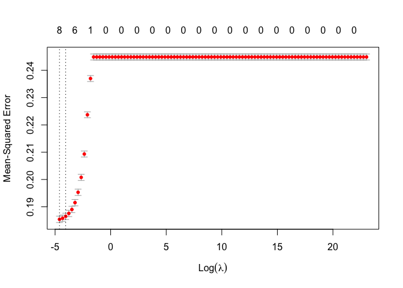

401_sexualiaty
================
Grace Lock
2024-03-27

``` r
library(haven) #Reading in the data
library(dplyr)
```

    ## 
    ## Attaching package: 'dplyr'

    ## The following objects are masked from 'package:stats':
    ## 
    ##     filter, lag

    ## The following objects are masked from 'package:base':
    ## 
    ##     intersect, setdiff, setequal, union

``` r
library(tidyverse)
```

    ## ── Attaching core tidyverse packages ──────────────────────── tidyverse 2.0.0 ──
    ## ✔ forcats   1.0.0     ✔ readr     2.1.4
    ## ✔ ggplot2   3.4.3     ✔ stringr   1.5.0
    ## ✔ lubridate 1.9.3     ✔ tibble    3.2.1
    ## ✔ purrr     1.0.2     ✔ tidyr     1.3.0

    ## ── Conflicts ────────────────────────────────────────── tidyverse_conflicts() ──
    ## ✖ dplyr::filter() masks stats::filter()
    ## ✖ dplyr::lag()    masks stats::lag()
    ## ℹ Use the conflicted package (<http://conflicted.r-lib.org/>) to force all conflicts to become errors

``` r
library(socsci) #Helps with data manipulation
```

    ## Loading required package: rlang
    ## 
    ## Attaching package: 'rlang'
    ## 
    ## The following objects are masked from 'package:purrr':
    ## 
    ##     %@%, flatten, flatten_chr, flatten_dbl, flatten_int, flatten_lgl,
    ##     flatten_raw, invoke, splice
    ## 
    ## Loading required package: scales
    ## 
    ## Attaching package: 'scales'
    ## 
    ## The following object is masked from 'package:purrr':
    ## 
    ##     discard
    ## 
    ## The following object is masked from 'package:readr':
    ## 
    ##     col_factor
    ## 
    ## Loading required package: broom
    ## Loading required package: glue

``` r
library(glmnet) #Lasso Regression
```

    ## Loading required package: Matrix
    ## 
    ## Attaching package: 'Matrix'
    ## 
    ## The following objects are masked from 'package:tidyr':
    ## 
    ##     expand, pack, unpack
    ## 
    ## Loaded glmnet 4.1-8

``` r
library(leaps) #Best subset regression
library(MASS) #Ordinal logistic regression
```

    ## 
    ## Attaching package: 'MASS'
    ## 
    ## The following object is masked from 'package:dplyr':
    ## 
    ##     select

### Sexuality data

``` r
sexualitydata <- read_sav("/Users/gracelock/Downloads/Sexuality IAT.public.2023.sav")
```

``` r
sexualitydata |> dplyr::select("session_id", "birthyear", "num_002", "birthSex", "ethnicityomb", "edu",
                     "raceomb_002", "D_biep.Straight_Good_all", "Tgayleswomen", "Tgaymen", "Tstraightmen",
                     "politicalid_7") |>
                na.omit("D_biep.Straight_Good_all") |>
                mutate(age = 2024-birthyear) |> 
                dplyr::select(-birthyear) |> 
                rename("num_tests" = "num_002",
                      "ethnicity" = "ethnicityomb",
                      "race" = "raceomb_002",
                      "politicalid" = "politicalid_7",
                      "score" = "D_biep.Straight_Good_all",
                      "warmth_gayleswomen" = "Tgayleswomen",
                      "warmth_gaymen" = "Tgaymen",
                      "warmth_straightmen" = "Tstraightmen") |>
                 mutate(
                   race = case_when(
                     race %in% c(1, 2, 3, 4, 5, 7, 8) ~ 2,
                     race == 6 ~ 1
                   )
                 ) -> sexualitydata
```

``` r
#LASSO Regression 
predictor_vars <- c("num_tests", "ethnicity", "race", "politicalid", "warmth_gayleswomen", "warmth_gaymen",
                     "warmth_straightmen", "age", "edu", "birthSex")

X <- as.matrix(sexualitydata[, predictor_vars])  # Predictor matrix
Y <- sexualitydata$score  # Response variable

# Create a grid of lambda values for cross-validation
lambda_grid <- 10^seq(10, -2, length = 100)

# Perform cross-validated Lasso regression
lasso_model_cv <- cv.glmnet(X, Y, alpha = 1, lambda = lambda_grid, nfolds = 10)

# Plot mean squared error (MSE) vs lambda
plot(lasso_model_cv)
```

<!-- -->

``` r
# Select lambda with minimum MSE
best_lambda <- lasso_model_cv$lambda.min

# Refit the model with the selected lambda
lasso_model_best <- glmnet(X, Y, alpha = 1, lambda = best_lambda)

# Make predictions
predictions <- predict(lasso_model_best, newx = X)

# Calculate MSE
mse <- mean((predictions - Y)^2)

# Print MSE
print(paste('Mean Squared Error (MSE):', mse))
```

    ## [1] "Mean Squared Error (MSE): 0.185340845222981"

``` r
# Print the coefficients
print(coef(lasso_model_best))
```

    ## 11 x 1 sparse Matrix of class "dgCMatrix"
    ##                              s0
    ## (Intercept)         0.498143515
    ## num_tests          -0.008984463
    ## ethnicity           .          
    ## race                0.023158389
    ## politicalid        -0.061159227
    ## warmth_gayleswomen -0.027139362
    ## warmth_gaymen      -0.022716564
    ## warmth_straightmen  0.045794898
    ## age                 0.002277201
    ## edu                 .          
    ## birthSex           -0.056850362

``` r
print(best_lambda)
```

    ## [1] 0.01

``` r
#Best Subset Selection

# Generate all possible models
  all_models <- regsubsets(score ~ num_tests + ethnicity + politicalid + age + edu + 
                           birthSex + race + warmth_gayleswomen + warmth_gaymen + warmth_straightmen, 
                           data = sexualitydata, nvmax = 10)
  
  # Get the summary of all models
  summary_all <- summary(all_models)
  
  # Check if summary is empty
  if (length(summary_all$adjr2) == 0) {
    cat("No models were generated.")
    return(NULL)
  }
  
  # Find the best model based on adjusted R^2
  best_model <- which.max(summary_all$adjr2)
  
  # Get the details of the best model
  best_summary <- summary_all[best_model]
  
  # Get the formula of the best model
  formula_best <- names(which(summary_all$which[best_model, ]))
  
  # Print the results
  cat("Best model formula:", paste("y ~", paste(formula_best, collapse = " + ")), "\n")
```

    ## Best model formula: y ~ (Intercept) + num_tests + politicalid + age + edu + birthSex + race + warmth_gayleswomen + warmth_gaymen + warmth_straightmen

``` r
#Create categories

#create categories in score variable (no bias, moderate bias, strong bias)

# Define the breaks for creating three categories
breaks <- c(-Inf, -0.0001, 0.0001, 0.33, 0.66, Inf)

# Create a new categorical variable based on the breaks
sexualitydata$scorecat <- cut(sexualitydata$score, breaks = breaks, labels = c("Opposite", "None", "Low", "Medium", "High"))

# Print the summary of the new categorical variable
summary(sexualitydata$scorecat)
```

    ## Opposite     None      Low   Medium     High 
    ##    20175        3    11528    10209     6804

``` r
#Multi ordinal logistic regression 1 (best subset selection)

# Fit ordinal logistic regression model
sex_ord_model1 <- polr(scorecat ~ num_tests + politicalid + age + edu + ethnicity +
                           birthSex + race + warmth_gayleswomen + warmth_gaymen + warmth_straightmen, 
                  data = sexualitydata, Hess = TRUE)

# Summarize the model
summary(sex_ord_model1)
```

    ## Call:
    ## polr(formula = scorecat ~ num_tests + politicalid + age + edu + 
    ##     ethnicity + birthSex + race + warmth_gayleswomen + warmth_gaymen + 
    ##     warmth_straightmen, data = sexualitydata, Hess = TRUE)
    ## 
    ## Coefficients:
    ##                        Value Std. Error  t value
    ## num_tests          -0.071768  0.0075990  -9.4444
    ## politicalid        -0.257974  0.0062861 -41.0387
    ## age                 0.012073  0.0007835  15.4096
    ## edu                 0.012831  0.0043125   2.9753
    ## ethnicity           0.009915  0.0181975   0.5448
    ## birthSex           -0.297421  0.0191864 -15.5017
    ## race                0.189817  0.0190706   9.9534
    ## warmth_gayleswomen -0.111676  0.0056913 -19.6221
    ## warmth_gaymen      -0.117025  0.0057686 -20.2864
    ## warmth_straightmen  0.205754  0.0040353  50.9887
    ## 
    ## Intercepts:
    ##               Value    Std. Error t value 
    ## Opposite|None  -2.0084   0.0758   -26.4840
    ## None|Low       -2.0081   0.0758   -26.4799
    ## Low|Medium     -0.8295   0.0754   -11.0082
    ## Medium|High     0.5729   0.0753     7.6102
    ## 
    ## Residual Deviance: 115208.60 
    ## AIC: 115236.60

``` r
#Multi ordinal logistic regression 2 (lasso)

# Fit ordinal logistic regression model
sex_ord_model2 <- polr(scorecat ~ num_tests + politicalid + age + 
                           birthSex + race + warmth_gayleswomen + warmth_gaymen + warmth_straightmen, 
                  data = sexualitydata, Hess = TRUE)

# Summarize the model
summary(sex_ord_model2)
```

    ## Call:
    ## polr(formula = scorecat ~ num_tests + politicalid + age + birthSex + 
    ##     race + warmth_gayleswomen + warmth_gaymen + warmth_straightmen, 
    ##     data = sexualitydata, Hess = TRUE)
    ## 
    ## Coefficients:
    ##                       Value Std. Error t value
    ## num_tests          -0.07012  0.0075761  -9.255
    ## politicalid        -0.25581  0.0062432 -40.975
    ## age                 0.01318  0.0006956  18.950
    ## birthSex           -0.29804  0.0191847 -15.535
    ## race                0.18794  0.0189537   9.916
    ## warmth_gayleswomen -0.11242  0.0056866 -19.770
    ## warmth_gaymen      -0.11651  0.0057657 -20.207
    ## warmth_straightmen  0.20613  0.0040335  51.105
    ## 
    ## Intercepts:
    ##               Value    Std. Error t value 
    ## Opposite|None  -2.0615   0.0653   -31.5743
    ## None|Low       -2.0611   0.0653   -31.5685
    ## Low|Medium     -0.8829   0.0647   -13.6439
    ## Medium|High     0.5197   0.0646     8.0441
    ## 
    ## Residual Deviance: 115217.95 
    ## AIC: 115241.95

AICs: Ord model 1 has the lowest AIC value.

``` r
#table 
ctable <- coef(summary(sex_ord_model1))

#calculate and store p values
p <- pnorm(abs(ctable[, "t value"]), lower.tail = FALSE) * 2

## combined table
ctable <- cbind(ctable, "p value" = p)

# Define significance levels
significance <- ifelse(ctable[, "p value"] < 0.001, "***",
                       ifelse(ctable[, "p value"] < 0.01, "**",
                              ifelse(ctable[, "p value"] < 0.05, "*",
                                     ifelse(ctable[, "p value"] < 0.1, ".",""))))

# Add significance levels to the table
ctable <- cbind(ctable, "Significance" = significance)

ctable
```

    ##                    Value                 Std. Error            
    ## num_tests          "-0.071768199045737"  "0.00759900702396422" 
    ## politicalid        "-0.257973956173162"  "0.00628610707847893" 
    ## age                "0.0120727048184326"  "0.000783454864321734"
    ## edu                "0.0128307841376859"  "0.00431246315104046" 
    ## ethnicity          "0.00991491238492391" "0.0181975454432063"  
    ## birthSex           "-0.297421235011877"  "0.0191863857099779"  
    ## race               "0.189817206820644"   "0.0190706496051345"  
    ## warmth_gayleswomen "-0.111675647300039"  "0.00569131922939272" 
    ## warmth_gaymen      "-0.117024741631771"  "0.00576861798204491" 
    ## warmth_straightmen "0.205754018089654"   "0.00403528640721699" 
    ## Opposite|None      "-2.0083799668939"    "0.0758338186760216"  
    ## None|Low           "-2.00807126007787"   "0.0758336836791779"  
    ## Low|Medium         "-0.829546552105801"  "0.0753571245299751"  
    ## Medium|High        "0.572888072900583"   "0.075279155963821"   
    ##                    t value             p value                 Significance
    ## num_tests          "-9.44441804296389" "3.57384699881335e-21"  "***"       
    ## politicalid        "-41.0387467080158" "0"                     "***"       
    ## age                "15.4095728652912"  "1.41141651135419e-53"  "***"       
    ## edu                "2.97527971562846"  "0.00292721501093267"   "**"        
    ## ethnicity          "0.544848887223164" "0.585857452408192"     ""          
    ## birthSex           "-15.5016812185321" "3.37932466766594e-54"  "***"       
    ## race               "9.95336869749514"  "2.43788161031087e-23"  "***"       
    ## warmth_gayleswomen "-19.6221021522203" "1.00125874615293e-85"  "***"       
    ## warmth_gaymen      "-20.2864433034074" "1.69417009519273e-91"  "***"       
    ## warmth_straightmen "50.9887024925094"  "0"                     "***"       
    ## Opposite|None      "-26.4839619309444" "1.48324636545759e-154" "***"       
    ## None|Low           "-26.4799382365917" "1.65027173052107e-154" "***"       
    ## Low|Medium         "-11.0082033686918" "3.48891687536471e-28"  "***"       
    ## Medium|High        "7.61018193636379"  "2.73710350004525e-14"  "***"

``` r
#Confidence intervals 
ci <- confint(sex_ord_model1)
```

    ## Waiting for profiling to be done...

``` r
ci
```

    ##                           2.5 %      97.5 %
    ## num_tests          -0.086667579 -0.05687905
    ## politicalid        -0.270305622 -0.24566507
    ## age                 0.010536406  0.01360733
    ## edu                 0.004394395  0.02129850
    ## ethnicity          -0.025751874  0.04557622
    ## birthSex           -0.335031165 -0.25982547
    ## race                0.152455534  0.22721138
    ## warmth_gayleswomen -0.122840396 -0.10053167
    ## warmth_gaymen      -0.128334241 -0.10572251
    ## warmth_straightmen  0.197865867  0.21368310

``` r
#Odds Ratio and confidence intervals 
exp(cbind(OR = coef(sex_ord_model1), ci))
```

    ##                           OR     2.5 %    97.5 %
    ## num_tests          0.9307466 0.9169819 0.9447083
    ## politicalid        0.7726154 0.7631462 0.7821842
    ## age                1.0121459 1.0105921 1.0137003
    ## edu                1.0129135 1.0044041 1.0215269
    ## ethnicity          1.0099642 0.9745769 1.0466308
    ## birthSex           0.7427311 0.7153158 0.7711862
    ## race               1.2090286 1.1646907 1.2550951
    ## warmth_gayleswomen 0.8943343 0.8844048 0.9043565
    ## warmth_gaymen      0.8895632 0.8795593 0.8996743
    ## warmth_straightmen 1.2284510 1.2187989 1.2382302
