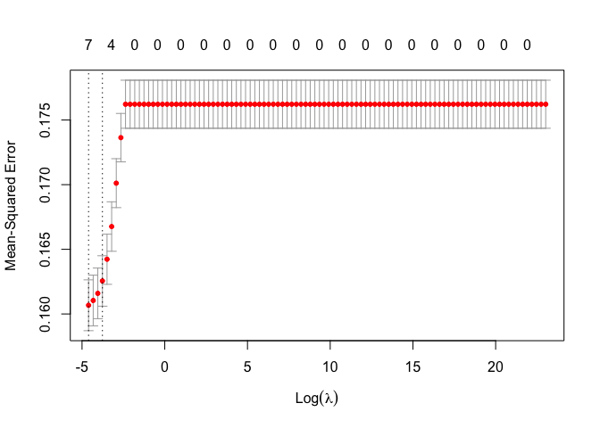
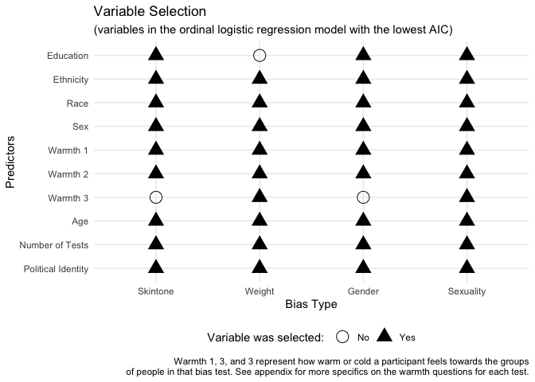

DA401 Project
================
Grace Lock
2024-01-30

``` r
library(haven) #Reading in the data
library(dplyr)
```

    ## 
    ## Attaching package: 'dplyr'

    ## The following objects are masked from 'package:stats':
    ## 
    ##     filter, lag

    ## The following objects are masked from 'package:base':
    ## 
    ##     intersect, setdiff, setequal, union

``` r
library(tidyverse)
```

    ## ── Attaching core tidyverse packages ──────────────────────── tidyverse 2.0.0 ──
    ## ✔ forcats   1.0.0     ✔ readr     2.1.4
    ## ✔ ggplot2   3.4.3     ✔ stringr   1.5.0
    ## ✔ lubridate 1.9.3     ✔ tibble    3.2.1
    ## ✔ purrr     1.0.2     ✔ tidyr     1.3.0

    ## ── Conflicts ────────────────────────────────────────── tidyverse_conflicts() ──
    ## ✖ dplyr::filter() masks stats::filter()
    ## ✖ dplyr::lag()    masks stats::lag()
    ## ℹ Use the conflicted package (<http://conflicted.r-lib.org/>) to force all conflicts to become errors

``` r
library(socsci) #Helps with data manipulation
```

    ## Loading required package: rlang
    ## 
    ## Attaching package: 'rlang'
    ## 
    ## The following objects are masked from 'package:purrr':
    ## 
    ##     %@%, flatten, flatten_chr, flatten_dbl, flatten_int, flatten_lgl,
    ##     flatten_raw, invoke, splice
    ## 
    ## Loading required package: scales
    ## 
    ## Attaching package: 'scales'
    ## 
    ## The following object is masked from 'package:purrr':
    ## 
    ##     discard
    ## 
    ## The following object is masked from 'package:readr':
    ## 
    ##     col_factor
    ## 
    ## Loading required package: broom
    ## Loading required package: glue

``` r
library(glmnet) #Lasso Regression
```

    ## Loading required package: Matrix
    ## 
    ## Attaching package: 'Matrix'
    ## 
    ## The following objects are masked from 'package:tidyr':
    ## 
    ##     expand, pack, unpack
    ## 
    ## Loaded glmnet 4.1-8

``` r
library(reshape2) #Lasso Regression visual
```

    ## 
    ## Attaching package: 'reshape2'
    ## 
    ## The following object is masked from 'package:tidyr':
    ## 
    ##     smiths

``` r
library(leaps) #Best subset regression
library(MASS) #Multiordinal logistic regression - messes with dplyr select function
```

    ## 
    ## Attaching package: 'MASS'
    ## 
    ## The following object is masked from 'package:dplyr':
    ## 
    ##     select

### Skin tone data

``` r
skintonedata <- read_sav("/Users/gracelock/Downloads/Skin IAT.public.2023 2.sav")

skintonedata |>  dplyr::select("session_id", "birthyear", "birthSex", "politicalid_7",
                                 "num_002", "ethnicityomb", "raceomb_002", "edu", "D_biep.LightSkin_Good_all", 
                                 "att7", "Tdark", "Tlight") |>
                 na.omit("D_biep.LightSkin_Good_all") |>
                 rename("num_tests" = "num_002",
                        "ethnicity" = "ethnicityomb",
                        "race" = "raceomb_002",
                        "politicalid" = "politicalid_7",
                        "skintone_preference" = "att7",
                        "warmth_dark" = "Tdark",
                        "warmth_light" = "Tlight",
                        "score" = "D_biep.LightSkin_Good_all") |>
                 mutate(age = 2024 - birthyear) |>
                 dplyr::select(-birthyear) |>
                 mutate(
                   race = case_when(
                     race %in% c(1, 2, 3, 4, 5, 7, 8) ~ 2,
                     race == 6 ~ 1
                   )
                 )-> skintonedata

#birthsex: 1 = male, 2 = female

#warmth: 0 "Extremely cold" 1 "Very cold" 2 "Moderately cold" 3 "Somewhat cold" 4 "Slightly cold" 5 "Neither warm nor cold" 6 "Slightly warm" 7 "Somewhat warm" 8 "Moderately warm" 9 "Very warm" 10 "Extremely warm" 

#skintone_preference: 1 "I strongly prefer Dark Skinned People to Light Skinned People." 2 "I moderately prefer Dark Skinned People to Light Skinned People." 3 "I slightly prefer Dark Skinned People to Light Skinned People." 4 "I like Light Skinned People and Dark Skinned People equally." 5 "I slightly prefer Light Skinned People to Dark Skinned People." 6 "I moderately prefer Light Skinned People to Dark Skinned People." 7 "I strongly prefer Light Skinned People to Dark Skinned People." 

#race: 1 = American Indian/Alaska Native, 2 = East Asian, 3 = South Asian, 4 = Native Hawaiian or other Pacific #Islander, 5 = Black or African American, 6 = White, 7 = Other or Unknown, 8 = Multiracial

#ethnicity:1 "Hispanic or Latino" 2 "Not Hispanic or Latino" 3 "Unknown"

#politicalid: 1 "strongly conservative" 2 "moderately conservative" 3 "slightly conservative" 4 "neutral" 5 "slightly liberal" 6 "moderately liberal" 7 "strongly liberal"
```

Non-zero coefficients: Predictors with non-zero coefficients in the
printed output are selected by the Lasso regression model. These
predictors are deemed to have a significant influence on the response
variable.

Zero coefficients: Predictors with coefficients set to zero in the
printed output are effectively excluded from the model. These predictors
are considered to have little or no impact on the response variable
according to the Lasso regularization.

Coefficient values: The magnitude of the coefficients indicates the
strength of the relationship between each predictor and the response
variable. Larger coefficient values suggest stronger relationships,
whereas smaller values suggest weaker relationships.

Intercept term: Lasso regression also estimates an intercept term, which
represents the expected value of the response variable when all
predictor variables are zero.

``` r
#LASSO Regression 
predictor_vars <- c('num_tests', 'ethnicity', 'race', 'politicalid', 'skintone_preference', 'warmth_dark',
                'warmth_light', 'age', 'edu', 'birthSex')

X <- as.matrix(skintonedata[, predictor_vars])  # Predictor matrix
Y <- skintonedata$score  # Response variable

# Create a grid of lambda values for cross-validation
lambda_grid <- 10^seq(10, -2, length = 100)

# Perform cross-validated Lasso regression
lasso_model_cv <- cv.glmnet(X, Y, alpha = 1, lambda = lambda_grid, nfolds = 10)

# Plot mean squared error (MSE) vs lambda
plot(lasso_model_cv)
```

<!-- -->

``` r
# Select lambda with minimum MSE
best_lambda <- lasso_model_cv$lambda.min

# Refit the model with the selected lambda
lasso_model_best <- glmnet(X, Y, alpha = 1, lambda = best_lambda)

# Make predictions
predictions <- predict(lasso_model_best, newx = X)

# Calculate MSE
mse <- mean((predictions - Y)^2)

# Print MSE
print(paste('Mean Squared Error (MSE):', mse))
```

    ## [1] "Mean Squared Error (MSE): 0.160579293383362"

``` r
# Print the coefficients
print(coef(lasso_model_best))
```

    ## 11 x 1 sparse Matrix of class "dgCMatrix"
    ##                               s0
    ## (Intercept)          0.149218865
    ## num_tests           -0.031931277
    ## ethnicity            0.002886895
    ## race                -0.099739711
    ## politicalid         -0.013725137
    ## skintone_preference  0.071068168
    ## warmth_dark          .          
    ## warmth_light         .          
    ## age                  0.002684395
    ## edu                  0.001221732
    ## birthSex             .

``` r
print(best_lambda)
```

    ## [1] 0.01

``` r
#Dot Plot 
df <- data.frame(
  Row = c("Sex", "Education", "Political Identity", "Age", "Race", "Ethnicity", "Number of Tests", 
                  "Warmth 1", "Warmth 2", "Warmth 3"),
  Skintone = c(1, 1, 1, 1, 1, 1, 1, 1, 1, 0),
  Weight = c(1, 0, 1, 1, 1, 1, 1, 1, 1, 1),
  Gender = c(1, 1, 1, 1, 1, 1, 1, 1, 1, 0),
  Sexuality = c(1, 1, 1, 1, 1, 1, 1, 1, 1, 1)
)

data_long <- melt(df, id.vars = "Row", variable.name = "Category", value.name = "Value")
data_long$Row <- factor(data_long$Row, levels = c("Political Identity", "Number of Tests", "Age", "Warmth 3",
                                                  "Warmth 2", "Warmth 1", "Sex", "Race", "Ethnicity", "Education"))

data_long |> 
  ggplot() + 
  aes(x = Category, y = Row, shape = as.factor(Value)) + 
  geom_point(size = 5) +
  scale_shape_manual(values = c(1, 17), labels = c("No", "Yes")) +
  labs(title = "Variable Selection",
       x = "Bias Type",
       y = "Predictors",
       shape = "Variable was selected: ",
       subtitle = "(variables in the ordinal logistic regression model with the lowest AIC)",
       caption = "Warmth 1, 3, and 3 represent how warm or cold a participant feels towards the groups\nof people in that bias test. See appendix for more specifics on the warmth questions for each test.") +
  theme_minimal() +
  theme(legend.position = "bottom") 
```

<!-- -->

``` r
#Best Subset Selection

# Generate all possible models
  all_models <- regsubsets(score ~ num_tests + ethnicity + race + politicalid + skintone_preference +
                             warmth_dark + warmth_light + age + edu + birthSex, 
                           data = skintonedata, nvmax = 10)
  
  # Get the summary of all models
  summary_all <- summary(all_models)
  
  # Find the best model based on adjusted R^2
  best_model <- which.max(summary_all$adjr2)
  
  # Get the details of the best model
  best_summary <- summary_all[best_model]
  
  # Get the formula of the best model
  formula_best <- names(which(summary_all$which[best_model, ]))
  
  # Print the results
  cat("Best model formula:", paste("y ~", paste(formula_best, collapse = " + ")), "\n")
```

    ## Best model formula: y ~ (Intercept) + num_tests + ethnicity + race + politicalid + skintone_preference + warmth_light + age + edu + birthSex

``` r
#Create categories

#create categories in score variable (no bias, moderate bias, strong bias)

# Define the breaks for creating three categories
breaks <- c(-Inf, -0.0001, 0.0001, 0.33, 0.66, Inf)

# Create a new categorical variable based on the breaks
skintonedata$scorecat <- cut(skintonedata$score, breaks = breaks, labels = c("Opposite", "None", "Low", "Medium", "High"))

# Print the summary of the new categorical variable
summary(skintonedata$scorecat)
```

    ## Opposite     None      Low   Medium     High 
    ##     5912        4     6575     7024     4296

``` r
#Multi ordinal logistic regression 1 (best subset selection)

# Fit ordinal logistic regression model
skin_ord_model1 <- polr(scorecat ~ num_tests + ethnicity + politicalid + skintone_preference +
                    warmth_light + age + edu + birthSex, data = skintonedata, Hess = TRUE)

# Summarize the model
summary(skin_ord_model1)
```

    ## Call:
    ## polr(formula = scorecat ~ num_tests + ethnicity + politicalid + 
    ##     skintone_preference + warmth_light + age + edu + birthSex, 
    ##     data = skintonedata, Hess = TRUE)
    ## 
    ## Coefficients:
    ##                          Value Std. Error t value
    ## num_tests           -0.1672490  0.0107481 -15.561
    ## ethnicity            0.1108248  0.0231440   4.788
    ## politicalid         -0.0801991  0.0076518 -10.481
    ## skintone_preference  0.3895441  0.0141447  27.540
    ## warmth_light        -0.0002482  0.0002067  -1.201
    ## age                  0.0157015  0.0010196  15.400
    ## edu                  0.0242110  0.0056499   4.285
    ## birthSex            -0.0764310  0.0261891  -2.918
    ## 
    ## Intercepts:
    ##               Value    Std. Error t value 
    ## Opposite|None   0.4758   0.0983     4.8422
    ## None|Low        0.4768   0.0983     4.8517
    ## Low|Medium      1.7442   0.0988    17.6520
    ## Medium|High     3.2328   0.1004    32.2041
    ## 
    ## Residual Deviance: 63564.17 
    ## AIC: 63588.17

``` r
#Multi ordinal logistic regression 2 (lassos)

# Fit ordinal logistic regression model
skin_ord_model2 <- polr(scorecat ~ num_tests + ethnicity + politicalid + skintone_preference +
                     age + edu, 
                   data = skintonedata, Hess = TRUE)

# Summarize the model
summary(skin_ord_model2)
```

    ## Call:
    ## polr(formula = scorecat ~ num_tests + ethnicity + politicalid + 
    ##     skintone_preference + age + edu, data = skintonedata, Hess = TRUE)
    ## 
    ## Coefficients:
    ##                        Value Std. Error t value
    ## num_tests           -0.16952   0.010723 -15.810
    ## ethnicity            0.11111   0.023141   4.801
    ## politicalid         -0.08210   0.007624 -10.769
    ## skintone_preference  0.39193   0.014109  27.780
    ## age                  0.01572   0.001019  15.424
    ## edu                  0.02393   0.005647   4.238
    ## 
    ## Intercepts:
    ##               Value    Std. Error t value 
    ## Opposite|None   0.6037   0.0879     6.8657
    ## None|Low        0.6048   0.0879     6.8779
    ## Low|Medium      1.8720   0.0886    21.1313
    ## Medium|High     3.3600   0.0904    37.1538
    ## 
    ## Residual Deviance: 63574.22 
    ## AIC: 63594.22

Ord model 1 has the lowest AIC.

``` r
#table 
ctable <- coef(summary(skin_ord_model1))

#calculate and store p values
p <- pnorm(abs(ctable[, "t value"]), lower.tail = FALSE) * 2

## combined table
ctable <- cbind(ctable, "p value" = p)

# Define significance levels
significance <- ifelse(ctable[, "p value"] < 0.001, "***",
                       ifelse(ctable[, "p value"] < 0.01, "**",
                              ifelse(ctable[, "p value"] < 0.05, "*",
                                     ifelse(ctable[, "p value"] < 0.1, ".",""))))

# Add significance levels to the table
ctable <- cbind(ctable, "Significance" = significance)

## combined table
ctable <- cbind(ctable, "p value" = p)

ctable
```

    ##                     Value                   Std. Error            
    ## num_tests           "-0.167249035077105"    "0.0107481227157631"  
    ## ethnicity           "0.110824836867748"     "0.0231440215784069"  
    ## politicalid         "-0.0801991281770889"   "0.00765182551649003" 
    ## skintone_preference "0.389544072295989"     "0.0141447311365155"  
    ## warmth_light        "-0.000248173276465013" "0.000206686614589807"
    ## age                 "0.0157014614723173"    "0.00101957642519853" 
    ## edu                 "0.0242110063489545"    "0.00564988059919886" 
    ## birthSex            "-0.0764310365581549"   "0.0261890797444129"  
    ## Opposite|None       "0.47584288669246"      "0.0982708610848353"  
    ## None|Low            "0.476782081561754"     "0.0982707738684094"  
    ## Low|Medium          "1.74418011543194"      "0.0988094802362408"  
    ## Medium|High         "3.23278964430495"      "0.100384279442645"   
    ##                     t value             p value                 Significance
    ## num_tests           "-15.5607671683744" "1.34477313235677e-54"  "***"       
    ## ethnicity           "4.78848658571707"  "1.68043794092532e-06"  "***"       
    ## politicalid         "-10.4810450792763" "1.05570616316564e-25"  "***"       
    ## skintone_preference "27.53987110369"    "5.8516284525146e-167"  "***"       
    ## warmth_light        "-1.20072253811666" "0.229858848432202"     ""          
    ## age                 "15.3999848214026"  "1.63707773330718e-53"  "***"       
    ## edu                 "4.28522442622726"  "1.82554807464002e-05"  "***"       
    ## birthSex            "-2.91843154872444" "0.00351797104640997"   "**"        
    ## Opposite|None       "4.84215647893504"  "1.28437554463661e-06"  "***"       
    ## None|Low            "4.8517179909481"   "1.22396579680746e-06"  "***"       
    ## Low|Medium          "17.6519511211053"  "9.83006614602313e-70"  "***"       
    ## Medium|High         "32.2041425435744"  "1.54429774239143e-227" "***"       
    ##                     p value                
    ## num_tests           "1.34477313235677e-54" 
    ## ethnicity           "1.68043794092532e-06" 
    ## politicalid         "1.05570616316564e-25" 
    ## skintone_preference "5.8516284525146e-167" 
    ## warmth_light        "0.229858848432202"    
    ## age                 "1.63707773330718e-53" 
    ## edu                 "1.82554807464002e-05" 
    ## birthSex            "0.00351797104640997"  
    ## Opposite|None       "1.28437554463661e-06" 
    ## None|Low            "1.22396579680746e-06" 
    ## Low|Medium          "9.83006614602313e-70" 
    ## Medium|High         "1.54429774239143e-227"

``` r
#Confidence intervals 
ci <- confint(skin_ord_model1)
```

    ## Waiting for profiling to be done...

``` r
ci
```

    ##                            2.5 %        97.5 %
    ## num_tests           -0.188329076 -0.1461968789
    ## ethnicity            0.065473072  0.1561896113
    ## politicalid         -0.095199883 -0.0652050990
    ## skintone_preference  0.361865208  0.4173085284
    ## warmth_light        -0.000646795  0.0001498619
    ## age                  0.013706213  0.0177026237
    ## edu                  0.013135237  0.0352838965
    ## birthSex            -0.127773619 -0.0250896210

The 95% confidence intervals do not cross 0 so therefore they are
significant - though they are very close to 0.

``` r
#Odds Ratio and confidence intervals 
exp(cbind(OR = coef(skin_ord_model1), ci))
```

    ##                            OR     2.5 %    97.5 %
    ## num_tests           0.8459889 0.8283421 0.8639876
    ## ethnicity           1.1171992 1.0676640 1.1690478
    ## politicalid         0.9229325 0.9091912 0.9368753
    ## skintone_preference 1.4763076 1.4360054 1.5178707
    ## warmth_light        0.9997519 0.9993534 1.0001499
    ## age                 1.0158254 1.0138006 1.0178602
    ## edu                 1.0245065 1.0132219 1.0359138
    ## birthSex            0.9264168 0.8800526 0.9752225

For every one unit increase in number of tests taken, the odds of being
more bias is multiplied .85 times, holding constant all other variables.
For every one unit increase in ethnicity, the odds of being more bias is
multiplied 1.12 times or increases 12%, holding constant all other
variables. The odds ratio is greatest for skintone_preference showing
that this has the greatest impact which is in line with other models.
