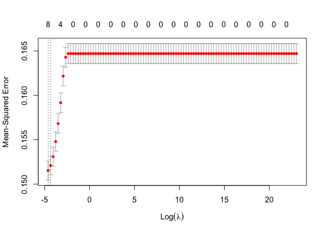

401_Weight
================
Grace Lock
2024-03-27

``` r
library(haven) #Reading in the data
library(dplyr)
```

    ## 
    ## Attaching package: 'dplyr'

    ## The following objects are masked from 'package:stats':
    ## 
    ##     filter, lag

    ## The following objects are masked from 'package:base':
    ## 
    ##     intersect, setdiff, setequal, union

``` r
library(tidyverse)
```

    ## ── Attaching core tidyverse packages ──────────────────────── tidyverse 2.0.0 ──
    ## ✔ forcats   1.0.0     ✔ readr     2.1.4
    ## ✔ ggplot2   3.4.3     ✔ stringr   1.5.0
    ## ✔ lubridate 1.9.3     ✔ tibble    3.2.1
    ## ✔ purrr     1.0.2     ✔ tidyr     1.3.0

    ## ── Conflicts ────────────────────────────────────────── tidyverse_conflicts() ──
    ## ✖ dplyr::filter() masks stats::filter()
    ## ✖ dplyr::lag()    masks stats::lag()
    ## ℹ Use the conflicted package (<http://conflicted.r-lib.org/>) to force all conflicts to become errors

``` r
library(socsci) #Helps with data manipulation
```

    ## Loading required package: rlang
    ## 
    ## Attaching package: 'rlang'
    ## 
    ## The following objects are masked from 'package:purrr':
    ## 
    ##     %@%, flatten, flatten_chr, flatten_dbl, flatten_int, flatten_lgl,
    ##     flatten_raw, invoke, splice
    ## 
    ## Loading required package: scales
    ## 
    ## Attaching package: 'scales'
    ## 
    ## The following object is masked from 'package:purrr':
    ## 
    ##     discard
    ## 
    ## The following object is masked from 'package:readr':
    ## 
    ##     col_factor
    ## 
    ## Loading required package: broom
    ## Loading required package: glue

``` r
library(glmnet) #Lasso Regression
```

    ## Loading required package: Matrix
    ## 
    ## Attaching package: 'Matrix'
    ## 
    ## The following objects are masked from 'package:tidyr':
    ## 
    ##     expand, pack, unpack
    ## 
    ## Loaded glmnet 4.1-8

``` r
library(leaps) #Best subset regression
library(MASS) #Ordinal logistic regression
```

    ## 
    ## Attaching package: 'MASS'
    ## 
    ## The following object is masked from 'package:dplyr':
    ## 
    ##     select

### Weight data

``` r
weightdata <- read_sav("/Users/gracelock/Downloads/Weight IAT.public.2023.sav")
```

``` r
weightdata |> dplyr::select("session_id", "birthyear", "num_002", "birthSex", "ethnicityomb", "edu",
                            "politicalid_7", "raceomb_002", "D_biep.Thin_Good_all", "att7", "tthin", 
                            "tfat", "comptomost_001") |>
              na.omit("D_biep.Thin_Good_all") |>
              mutate(age = 2024-birthyear) |> 
              dplyr::select(-birthyear) |> 
              rename("num_tests" = "num_002",
                      "ethnicity" = "ethnicityomb",
                      "race" = "raceomb_002",
                      "score" = "D_biep.Thin_Good_all",
                      "body_preference" = "att7",
                      "warmth_thin" = "tthin",
                      "warmth_fat" = "tfat",
                      "comptomost" = "comptomost_001",
                      "politicalid" = "politicalid_7") |>
                 mutate(
                   race = case_when(
                     race %in% c(1, 2, 3, 4, 5, 7, 8) ~ 2,
                     race == 6 ~ 1
                   )
                 )-> weightdata

#comptomost: 1 "Much thinner" 2 "Moderately thinner" 3 "Slightly thinner" 4 "About the same" 5 "Slightly heavier" 6 "Moderately heavier" 7 "Much heavier"
```

``` r
#LASSO Regression

predictor_vars <- c("num_tests", "ethnicity", "politicalid", "age", "edu", 
                           "birthSex", "race", "warmth_thin", "warmth_fat", "comptomost")

X <- as.matrix(weightdata[, predictor_vars])  # Predictor matrix
Y <- weightdata$score  # Response variable

# Create a grid of lambda values for cross-validation
lambda_grid <- 10^seq(10, -2, length = 100)

# Perform cross-validated Lasso regression
lasso_model_cv <- cv.glmnet(X, Y, alpha = 1, lambda = lambda_grid, nfolds = 10)

# Plot mean squared error (MSE) vs lambda
plot(lasso_model_cv)
```

<!-- -->

``` r
# Select lambda with minimum MSE
best_lambda <- lasso_model_cv$lambda.min

# Refit the model with the selected lambda
lasso_model_best <- glmnet(X, Y, alpha = 1, lambda = best_lambda)

# Make predictions
predictions <- predict(lasso_model_best, newx = X)

# Calculate MSE
mse <- mean((predictions - Y)^2)

# Print MSE
print(paste('Mean Squared Error (MSE):', mse))
```

    ## [1] "Mean Squared Error (MSE): 0.151466270197564"

``` r
# Print the coefficients
print(coef(lasso_model_best))
```

    ## 11 x 1 sparse Matrix of class "dgCMatrix"
    ##                       s0
    ## (Intercept)  0.790384193
    ## num_tests   -0.053262916
    ## ethnicity    .          
    ## politicalid -0.016534542
    ## age          0.001177856
    ## edu          .          
    ## birthSex    -0.014138696
    ## race        -0.030794258
    ## warmth_thin  0.014705998
    ## warmth_fat  -0.020122442
    ## comptomost  -0.025423848

``` r
print(best_lambda)
```

    ## [1] 0.01

``` r
#Best Subset Selection

# Generate all possible models
  all_models <- regsubsets(score ~ num_tests + ethnicity + politicalid + age + edu + 
                           birthSex + race + warmth_thin + warmth_fat + comptomost, 
                           data = weightdata, nvmax = 10)
  
  # Get the summary of all models
  summary_all <- summary(all_models)
  
  # Check if summary is empty
  if (length(summary_all$adjr2) == 0) {
    cat("No models were generated.")
    return(NULL)
  }
  
  # Find the best model based on adjusted R^2
  best_model <- which.max(summary_all$adjr2)
  
  # Get the details of the best model
  best_summary <- summary_all[best_model]
  
  # Get the formula of the best model
  formula_best <- names(which(summary_all$which[best_model, ]))
  
  # Print the results
  cat("Best model formula:", paste("y ~", paste(formula_best, collapse = " + ")), "\n")
```

    ## Best model formula: y ~ (Intercept) + num_tests + ethnicity + politicalid + age + edu + birthSex + race + warmth_thin + warmth_fat + comptomost

``` r
#Create categories

#create categories in score variable (no bias, moderate bias, strong bias)

# Define the breaks for creating three categories
breaks <- c(-Inf, -0.0001, 0.0001, 0.33, 0.66, Inf)

# Create a new categorical variable based on the breaks
weightdata$scorecat <- cut(weightdata$score, breaks = breaks, labels = c("Opposite", "None", "Low", "Medium", "High"))

# Print the summary of the new categorical variable
summary(weightdata$scorecat)
```

    ## Opposite     None      Low   Medium     High 
    ##     6101        6    10628    15460    15969

``` r
#Multi ordinal logistic regression 1 (best subset selection)

# Fit ordinal logistic regression model
weight_ord_model1 <- polr(scorecat ~ num_tests + politicalid + age + edu + birthSex + race 
                   + warmth_thin + warmth_fat + comptomost,
                  data = weightdata, Hess = TRUE)

# Summarize the model
summary(weight_ord_model1)
```

    ## Call:
    ## polr(formula = scorecat ~ num_tests + politicalid + age + edu + 
    ##     birthSex + race + warmth_thin + warmth_fat + comptomost, 
    ##     data = weightdata, Hess = TRUE)
    ## 
    ## Coefficients:
    ##                 Value Std. Error t value
    ## num_tests   -0.274305  0.0076086 -36.052
    ## politicalid -0.091696  0.0053527 -17.131
    ## age          0.008638  0.0007361  11.735
    ## edu         -0.004794  0.0041599  -1.152
    ## birthSex    -0.148691  0.0193046  -7.702
    ## race        -0.229030  0.0187461 -12.217
    ## warmth_thin  0.111649  0.0050833  21.964
    ## warmth_fat  -0.126671  0.0046697 -27.126
    ## comptomost  -0.140222  0.0068293 -20.532
    ## 
    ## Intercepts:
    ##               Value    Std. Error t value 
    ## Opposite|None  -3.8670   0.0689   -56.1233
    ## None|Low       -3.8657   0.0689   -56.1059
    ## Low|Medium     -2.4975   0.0675   -37.0083
    ## Medium|High    -1.0784   0.0667   -16.1740
    ## 
    ## Residual Deviance: 123748.20 
    ## AIC: 123774.20

``` r
#Multi ordinal logistic regression 2 (lasso)

# Fit ordinal logistic regression model
weight_ord_model2 <- polr(scorecat ~ num_tests + politicalid + age + 
                           birthSex + warmth_thin + warmth_fat + comptomost, 
                  data = weightdata, Hess = TRUE)

# Summarize the model
summary(weight_ord_model2)
```

    ## Call:
    ## polr(formula = scorecat ~ num_tests + politicalid + age + birthSex + 
    ##     warmth_thin + warmth_fat + comptomost, data = weightdata, 
    ##     Hess = TRUE)
    ## 
    ## Coefficients:
    ##                 Value Std. Error t value
    ## num_tests   -0.273274  0.0075925 -35.993
    ## politicalid -0.095099  0.0052944 -17.962
    ## age          0.008895  0.0006618  13.441
    ## birthSex    -0.135307  0.0192610  -7.025
    ## warmth_thin  0.114618  0.0050760  22.581
    ## warmth_fat  -0.129934  0.0046601 -27.882
    ## comptomost  -0.139753  0.0068288 -20.465
    ## 
    ## Intercepts:
    ##               Value    Std. Error t value 
    ## Opposite|None  -3.5192   0.0616   -57.0856
    ## None|Low       -3.5171   0.0616   -57.0540
    ## Low|Medium     -2.1564   0.0602   -35.8135
    ## Medium|High    -0.7387   0.0595   -12.4203
    ## 
    ## Residual Deviance: 123900.75 
    ## AIC: 123922.75

Ord model 1 has a lower AIC

The AIC penalizes models for their complexity, meaning that it takes
into account both how well the model fits the data and how many
parameters it has. Therefore, when comparing models using AIC, the model
with the lowest AIC value is preferred because it achieves a good
balance between goodness of fit and simplicity.

``` r
#table 
ctable <- coef(summary(weight_ord_model1))

#calculate and store p values
p <- pnorm(abs(ctable[, "t value"]), lower.tail = FALSE) * 2

## combined table
ctable <- cbind(ctable, "p value" = p)

# Define significance levels
significance <- ifelse(ctable[, "p value"] < 0.001, "***",
                       ifelse(ctable[, "p value"] < 0.01, "**",
                              ifelse(ctable[, "p value"] < 0.05, "*",
                                     ifelse(ctable[, "p value"] < 0.1, ".",""))))

# Add significance levels to the table
ctable <- cbind(ctable, "Significance" = significance)

ctable
```

    ##               Value                 Std. Error             t value            
    ## num_tests     "-0.27430467777389"   "0.0076085766655926"   "-36.0520357262544"
    ## politicalid   "-0.0916963121344171" "0.00535270701557677"  "-17.1308296657325"
    ## age           "0.00863812589614164" "0.000736092294295748" "11.7351125165712" 
    ## edu           "-0.0047942735109064" "0.00415992421702568"  "-1.1524905889594" 
    ## birthSex      "-0.14869118771611"   "0.0193046325823279"   "-7.7023578191396" 
    ## race          "-0.229030023578903"  "0.018746090439237"    "-12.2174820569267"
    ## warmth_thin   "0.111649384609712"   "0.00508329146077565"  "21.963994288196"  
    ## warmth_fat    "-0.126670598932792"  "0.00466974313299132"  "-27.1258172720197"
    ## comptomost    "-0.140222390280943"  "0.00682931238873355"  "-20.5324317148342"
    ## Opposite|None "-3.86696321317491"   "0.0689011609698951"   "-56.1233389792154"
    ## None|Low      "-3.86566737758156"   "0.0688994194112789"   "-56.1059499573772"
    ## Low|Medium    "-2.49753391669783"   "0.0674858335617879"   "-37.0082695120179"
    ## Medium|High   "-1.0783921133107"    "0.0666746142891649"   "-16.1739535325058"
    ##               p value                 Significance
    ## num_tests     "1.28146482426279e-284" "***"       
    ## politicalid   "8.73994167846711e-66"  "***"       
    ## age           "8.42142591554129e-32"  "***"       
    ## edu           "0.24911953478056"      ""          
    ## birthSex      "1.33578210942368e-14"  "***"       
    ## race          "2.50730701792484e-34"  "***"       
    ## warmth_thin   "6.36506409031381e-107" "***"       
    ## warmth_fat    "4.88501313304085e-162" "***"       
    ## comptomost    "1.10504100436578e-93"  "***"       
    ## Opposite|None "0"                     "***"       
    ## None|Low      "0"                     "***"       
    ## Low|Medium    "8.43053483861354e-300" "***"       
    ## Medium|High   "7.6994872887655e-59"   "***"

``` r
#Confidence intervals 
ci <- confint(weight_ord_model1)
```

    ## Waiting for profiling to be done...

``` r
ci
```

    ##                    2.5 %       97.5 %
    ## num_tests   -0.289364064 -0.259125800
    ## politicalid -0.102313885 -0.081038513
    ## age          0.007221912  0.010149568
    ## edu         -0.013064799  0.003469408
    ## birthSex    -0.187034596 -0.110302874
    ## race        -0.266235435 -0.191732797
    ## warmth_thin  0.101531098  0.121737104
    ## warmth_fat  -0.135913871 -0.117352272
    ## comptomost  -0.153765752 -0.126620863

``` r
#Odds Ratio and confidence intervals 
exp(cbind(OR = coef(weight_ord_model1), ci))
```

    ##                    OR     2.5 %    97.5 %
    ## num_tests   0.7601005 0.7487396 0.7717259
    ## politicalid 0.9123822 0.9027461 0.9221582
    ## age         1.0086755 1.0072481 1.0102012
    ## edu         0.9952172 0.9870202 1.0034754
    ## birthSex    0.8618352 0.8294150 0.8955629
    ## race        0.7953047 0.7662587 0.8255274
    ## warmth_thin 1.1181208 1.1068643 1.1294571
    ## warmth_fat  0.8810238 0.8729178 0.8892719
    ## comptomost  0.8691649 0.8574729 0.8810677
